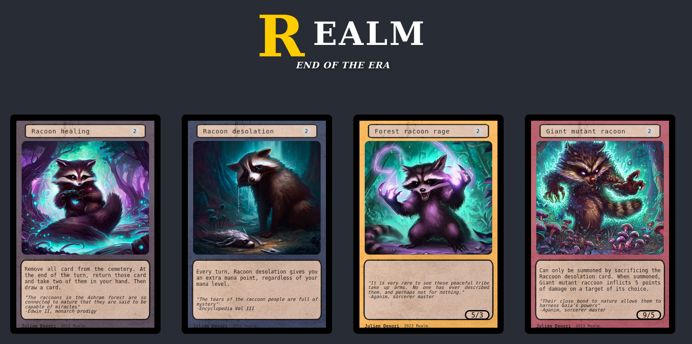

# Realm: End of Era (Currently in development)



Realm: End of Era is an immersive trading card game set in a fantastical world where players engage in strategic battles, collect powerful cards, and unravel the mysteries of the ancient realms. This game is built using React for the front-end and Node.js for the back-end.

## Features

- **Card Battles**: Experience thrilling one-on-one battles with your customized deck of powerful cards.
- **Card Collection**: Discover and collect a wide variety of unique cards with different abilities and attributes.
- **Strategic Gameplay**: Develop your own tactics, build synergistic decks, and outsmart your opponents.
- **Quests and Adventures**: Embark on epic quests and challenging adventures to earn rewards and unlock new cards.
- **Player Rankings**: Compete against other players and climb the global leaderboards.
- **Community Features**: Engage with a vibrant community of players, trade cards, and participate in tournaments.

## Installation

### Prerequisites

- Node.js (version X.X.X)
- npm (version X.X.X)

### Clone the Repository
```
git clone https://github.com/jdenozi/realm.git
cd realm-end-of-era
```

### Install Dependencies
```angular2html
npm install
```

### Configuration

Copy the sample configuration file and modify it with your own settings.
```angular2html
cp config/sample.config.js config/config.js
```

### Starting the Development Server
```angular2html
npm start
```


The development server should now be running at http://localhost:3000.

## Contributing

We welcome contributions from the community! To contribute to Realm: End of Era, please follow these steps:

1. Fork the repository.
2. Create a new branch for your feature or bug fix.
3. Make the necessary changes and ensure that the code passes all tests.
4. Commit your changes and push the branch to your forked repository.
5. Open a pull request in the main repository.

## License

Ream: End of the Era is licensed under the [Creative Commons Attribution-NonCommercial-NoDerivatives 4.0 International License](LICENSE.md).

This means that you are free to use, distribute, and share the game for non-commercial purposes only. You must give appropriate credit to the original authors and cannot make any modifications or create derivative works based on the game without explicit permission.

For more details about the license, please refer to the [LICENSE.md](LICENSE.md) file.

## Contact

If you have any questions or suggestions, feel free to reach out to us:

- Website: [https://www.realmendofera.com](https://www.realmendofera.com)
- Email: [contact@realmendofera.com](mailto:contact@realmendofera.com)
- Twitter: [@RealmGame](https://twitter.com/RealmGame)

We hope you enjoy playing Realm: End of Era! May the cards be in your favor as you venture into the realms of magic and adventure!
